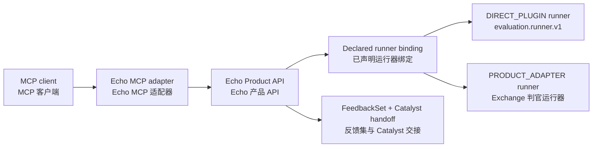

# MCP integration / MCP 集成

## Current posture / 当前状态

Echo does not currently ship an MCP server or client. Its active surface is the
FastAPI Product API in `src/cyrene_echo/` plus the local evaluation runner
profiles; there is no preserved `legacy/navigator-feedback` source.

Echo 当前不提供 MCP 服务端或客户端。其活跃范围是 `src/cyrene_echo/` 的 FastAPI
产品 API 与本地评估运行器配置档；不存在保留的 `legacy/navigator-feedback` 源材料。

The intended adapter boundary is documented here so protocol transport,
evaluation policy, and judge execution remain independently reviewable.

本文档记录预期适配边界，确保协议传输、评估策略与判官执行可以独立评审。

## Intended adapter boundary / 预期适配边界

An MCP adapter would call the same Product API endpoints a normal client uses
(`/api/v1/evaluation-runs`, `/api/v1/feedback-sets`, ...). It must not expose
arbitrary process, filesystem, or hardware controls, and it must not bypass
runner bindings, credentials, or fail-closed behavior.

MCP 适配器将调用与普通客户端相同的产品 API 端点（`/api/v1/evaluation-runs`、
`/api/v1/feedback-sets` 等）。它不得暴露任意进程、文件系统或硬件控制能力，也不得
绕过运行器绑定、凭证或 fail-closed 行为。

## Review checklist / 评审清单

- Validate suite identity, binding id, artifact reference, and timeouts before dispatch.
- Keep judge/provider transport failures distinct from scoring-policy outcomes.
- Preserve input digest, suite identity, binding id, and judge identity in results.
- Avoid returning provider secrets, internal endpoints, or unrestricted raw traces.
- Keep authentication, authorization, and request limits at the hosting boundary
  unless the API contract assigns them to Echo.

- 分发前校验套件身份、绑定 id、制品引用与超时。
- 将判官/提供方传输失败与评分策略结果分开。
- 在结果中保留输入摘要、套件身份、绑定 id 与判官身份。
- 避免返回提供方密钥、内部端点或不受限制的原始追踪信息。
- 除非 API 契约明确归属 Echo，认证、授权与请求限制应由宿主边界负责。
