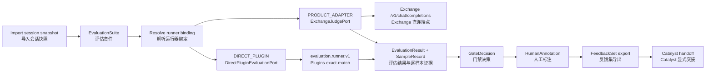

# Echo architecture overview / Echo 架构概览

## Role and boundary / 角色与边界

Echo owns model evaluation: importing session snapshots, executing evaluators
against immutable artifacts, persisting measurements and gate decisions,
collecting human annotations, and producing selected feedback exports for
Catalyst.

Echo 负责模型评估：导入会话快照、针对不可变制品执行评估器、持久化测量与门禁决策、
收集人工标注，并为 Catalyst 产出选定反馈导出。

The active runtime lives in `src/cyrene_echo/`. There is no preserved
`legacy/navigator-feedback` tree in this checkout; the evaluation Product
contract and its implementation are the same surface.

活跃运行时位于 `src/cyrene_echo/`。当前检出中不存在保留的
`legacy/navigator-feedback` 目录；评估产品契约与实现是同一套边界。

## Evaluation flow / 评估流程

`EvaluationExecutionPort` is Echo's application boundary. Its `DIRECT_PLUGIN`
adapter consumes the Plugins-owned `evaluation.runner.v1` endpoint by opaque
`connection_ref`; Platform may resolve lifecycle metadata but never carries
the evaluation payload. The judge profile selects Exchange directly.

`EvaluationExecutionPort` 是 Echo 的应用边界。其 `DIRECT_PLUGIN` 适配器通过不透明
`connection_ref` 消费 Plugins 所有的 `evaluation.runner.v1`；Platform 可解析生命周期
元数据，但不承载评估载荷。判官配置则直连 Exchange。

## Lifecycle states / 生命周期状态

| Stage | Meaning / 含义 | Main output / 主要输出 |
|---|---|---|
| Snapshot import | Publish session JSONL as an immutable artifact / 将会话 JSONL 发布为不可变制品 | `ArtifactRef` |
| Suite selection | Resolve suite, evaluator, fields, threshold / 解析套件、评估器、字段与阈值 | `EvaluationSuite` |
| Runner binding | Resolve the declared profile or fail closed / 解析已声明配置档或失败闭合 | `engineBindingId` |
| Execution | Run the selected Plugin or Exchange adapter / 执行插件或 Exchange 适配器 | `SampleRecord` rows |
| Measurement | Persist immutable score, counts, and report / 持久化不可变分数、计数与报告 | `EvaluationResult` |
| Gate decision | Apply the suite threshold policy / 应用套件阈值策略 | `GateDecision` |
| Human review | Record annotations without mutating measurements / 记录标注且不改写测量 | `HumanAnnotation` |
| Feedback export | Freeze selected candidates / 冻结选定候选 | `FeedbackSet` (`PREPARED`) |
| Catalyst handoff | Explicit direct Product call / 显式直连产品调用 | `HandoffReceipt` or stable failure |

A poor score is a successful run with a `FAIL` gate; execution failure is a
`FAILED` run. The live judge and live Catalyst handoff remain `WIRED_NOT_RUN`
without a reachable endpoint and credential.

低分是 `SUCCEEDED` 运行加 `FAIL` 门禁；执行失败是 `FAILED` 运行。没有可达端点与
凭证时，真实判官与真实 Catalyst 交接保持 `WIRED_NOT_RUN`。

## Ownership boundaries / 归属边界

- Echo owns evaluation orchestration, runner profiles, threshold policy, gates,
  annotations, and feedback selection; Plugins owns reusable scoring algorithms.
- Yield owns model training and produces static model checkpoints.
- Reactor owns model deployment and live serving endpoints.
- Catalyst owns dataset ingestion and raw cleaning; it converts selected
  feedback into preparations.
- Exchange owns model-provider serving; Echo's judge adapter calls its
  OpenAI-compatible endpoint directly.
- Platform Kernel owns generic process isolation and supervision.

- Echo 负责评估编排、运行器配置档、阈值策略、门禁、标注与反馈选择；Plugins 负责可复用评分算法。
- Yield 负责模型训练并产出静态模型检查点。
- Reactor 负责模型部署与在线服务端点。
- Catalyst 负责数据摄取与原始清洗，并将选定反馈转换为整理任务。
- Exchange 负责模型提供方服务；Echo 判官适配器直连其 OpenAI 兼容端点。
- Platform Kernel 负责通用进程隔离与监管。
