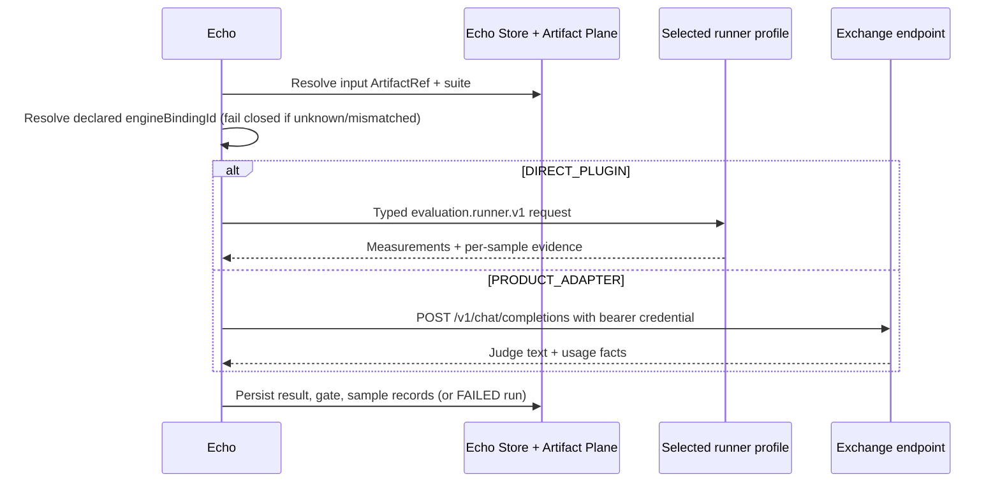

# Tool and capability system / 工具与能力系统

## Current posture / 当前状态

Echo consumes, but does not own, the Plugins-defined `evaluation.runner.v1`
contract through `EvaluationExecutionPort`. Exact-match payloads travel
directly to the resolved Plugin endpoint. The other remote business call is
the Exchange OpenAI-compatible judge endpoint through `ExchangeJudgePort`.

Echo 消费但不拥有 Plugins 定义的 `evaluation.runner.v1`，并通过
`EvaluationExecutionPort` 直连已解析插件端点。另一条远端业务调用由
`ExchangeJudgePort` 直连 Exchange 的 OpenAI 兼容判官端点。

## Runner seams / 运行器接缝

| Seam | Owner | Responsibility / 职责 | Status |
|---|---|---|---|
| `DIRECT_PLUGIN` profile (`DirectPluginEvaluationPort`) | Echo adapter + Plugins implementation | Product artifact mapping plus typed exact-match invocation / Product 制品映射与类型化精确匹配调用 | `LOCAL_ENDPOINT_VERIFIED` |
| `PRODUCT_ADAPTER` profile (`ExchangeJudgePort`) | Echo | Direct per-sample judge call to the configured Exchange endpoint / 直连 Exchange 端点逐样本判官调用 | `WIRED_NOT_RUN` without endpoint + credential |
| `evaluation.runner.v1` | Plugins | Reusable exact-match measurements; no Product state / 可复用精确匹配测量，不持有 Product 状态 | `DIRECT_RUNTIME_IMPLEMENTED` |
| `model.registry.v1` | not defined | No registry seam is consumed by Echo / Echo 不消费注册表接缝 | `NOT_DEFINED` |

`engineBindingId` must resolve to a declared binding
(`cyrene_echo.engine.RUNNER_BINDINGS`); undeclared or evaluator-mismatched
bindings fail closed before any runner executes. Test doubles are `MOCK` and
are never selectable at runtime.

`engineBindingId` 必须解析到已声明绑定（`cyrene_echo.engine.RUNNER_BINDINGS`）；
未声明或与评估器不匹配的绑定在任何运行器执行前 fail closed。测试替身为 `MOCK`，
运行时永不可选。

## Dispatch sequence / 分发时序

## Non-ownership rules / 非归属规则

- A runner must not decide product-level publication or recommendation policy
  outside its declared operation.
- Echo must not train, deploy, or serve models as a side effect of evaluation.
- Evaluation inputs and feedback handoffs are immutable artifact references;
  Echo never writes another Product's state.
- Reusable runner contracts and algorithms stay in Plugins; Echo may consume
  only declared versions through a resolved direct endpoint.
- Record model, suite, binding, provider, and judge identity with results when
  the contract requires reproducibility.

- 运行器不能在声明操作之外决定产品级发布或建议策略。
- Echo 不应因评估而训练、部署或服务化模型。
- 评估输入与反馈交接均为不可变制品引用；Echo 永不写入其他产品状态。
- 可复用运行器契约与算法保留在 Plugins；Echo 只能通过已解析直连端点消费已声明版本。
- 契约要求可复现时，应随结果记录模型、套件、绑定、提供方与判官身份。
